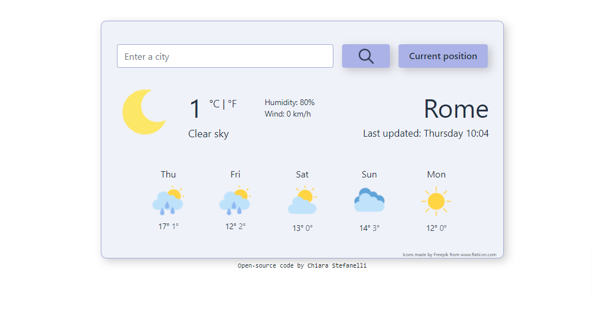

# Weather Forecast Website
This is the final Project from the [SheCodes Plus workshop](https://www.shecodes.io/plus). 
 [Verified Certificate](https://www.shecodes.io/certificates/6287aed3289a13f0025f00b96b3f27f0)

Project hosted on Netlify.
 [Live Site URL](https://shecodes-weatherwebsite.netlify.app)

## Built with
- HTML
- CSS
- Bootstrap
- JavaScript
- An active API

## Screenshot

## Author
Chiara Stefanelli
 [LinkedIn](https://www.linkedin.com/in/chiarastefanelli/?locale=en_US)
